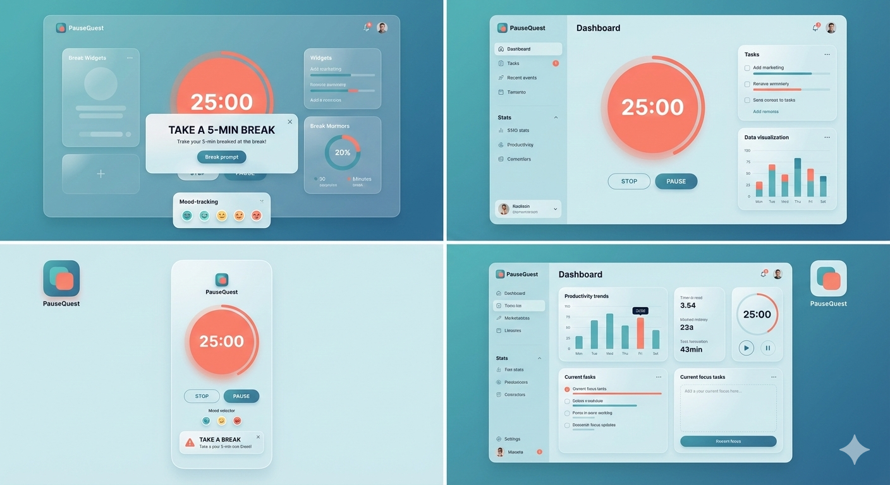

# PauseQuest

[](LICENSE) [](#) [](#)

A productivity web app that helps users manage focused work sessions and take meaningful breaks using a Pomodoro-style timer, break prompts, mood tracking, and an AI coach to provide personalized well‑being recommendations.

Live demo: [https://pausequest.vercel.app](https://pausequest.vercel.app)

Table of Contents
- Features
- Screenshot
- Tech Stack
- Architecture
- Quick Start
- Configuration (.env)
- Development
- Testing & Linting
- Deployment
- Contributing
- Roadmap
- License
- Contact

Features
- Pomodoro timer (configurable durations: focus, short break, long break).
- Break prompts and customizable break types (lunch, snack, water, stretch, custom).
- Mood tracking after each break and per-session notes.
- Session history: view past sessions, break logs, and mood trends.
- AI coach: personalized recommendations and reflections based on session history and mood.
- Settings: theme, notifications, sound, and session presets.
- Export data: CSV/JSON export of session logs (if implemented).

Screenshot


Tech Stack
- Frontend: React + TypeScript, Vite
- Backend / AI: Python (FastAPI)
- Other: FontAwesome for icons

Architecture (brief)
- Frontend (TypeScript): UI, timers, local state, calls backend for AI recommendations and session storage.
- Backend (Python): AI coach endpoints, optional persistence, authentication (if any).
- Data flow: timer → break prompt → user logs mood → frontend posts session to backend → AI processes and returns recommendations.

Quick Start (local)
Prereqs:
- Node 18+ and npm or pnpm
- (If applicable) Python 3.10+, virtualenv, and any backend deps

Clone and run:
```bash
git clone https://github.com/bryton90/pausequest.git
cd pausequest
# frontend
npm install
npm run dev    # open http://localhost:5173
# backend (if present)
# cd api
# pip install -r requirements.txt
# uvicorn main:app --reload
```

Configuration
Create .env from .env.example and set keys:
```
VITE_API_URL=http://localhost:8000
VITE_DEFAULT_FOCUS_MIN=25
# For AI: OPENAI_API_KEY=sk-...
```

Development
- Formatting: npm run format
- Linting: npm run lint
- Type check: npm run type-check
- Build: npm run build

Testing & CI
- Run tests:
  - Frontend: npm test
  - Backend: pytest
- Add a GitHub Actions workflow: runs on push/PR for tests, lint, and build.
- Add workflow badge at top once CI is configured.

Deployment
- Build and deploy the frontend to Vercel / Netlify / GitHub Pages.
- Deploy backend to Render / Railway / Fly / VPS.
- Add instructions or a deploy.yml for GitHub Actions if you want automated deploys.

Contributing
We welcome contributions! Please:
1. Fork the repo
2. Create a feature branch: git checkout -b feat/short-description
3. Run tests and linters locally
4. Open a PR describing the change and link any related issues

Please read CONTRIBUTING.md and CODE_OF_CONDUCT.md for details.

Roadmap
- Improve AI coach personalization and privacy options
- Analytics dashboard for user session trends
- Mobile PWA support and offline mode
- User accounts and sync across devices

License
This project is licensed under the MIT License — see the LICENSE file for details.

Acknowledgments
- Built with React and Vite
- Icons from FontAwesome

Contact
For questions, open an issue or contact bryton90 on GitHub.
